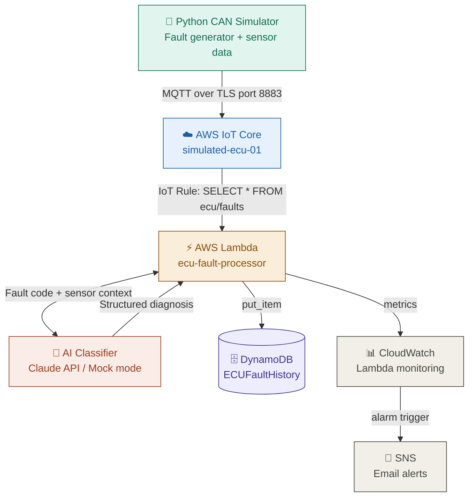

# ECU Fault Diagnostics — AI-Assisted Pipeline

> Simulates connected vehicle ECU fault data, streams it to AWS IoT Core in real time, and uses AI to automatically classify and explain fault codes — mimicking the diagnostic automation used by automotive OEMs for connected vehicle fleets.

---

## Problem It Solves

Modern connected vehicle fleets generate millions of fault events daily. Manual diagnosis by technicians cannot scale — a single fault takes 15–45 minutes to diagnose manually. This pipeline automates fault classification and root cause analysis using AI, reducing diagnostic time to under 3 seconds per fault.

**Relevant to:** JLR connected vehicle platform, Caterpillar industrial IoT, Bosch automotive diagnostics, Alten automotive DevOps.

---

## Architecture



**Data flow:**
1. Python simulator generates realistic CAN bus fault codes and sensor readings (RPM, coolant temp, battery voltage)
2. Messages published to AWS IoT Core via MQTT over mutual TLS authentication on port 8883
3. IoT Rule routes every message to Lambda using SQL: `SELECT * FROM 'ecu/faults'`
4. Lambda calls AI classifier — returns structured diagnosis (root cause, recommended action, safety risk)
5. Complete fault record stored permanently in DynamoDB
6. CloudWatch monitors Lambda errors and triggers SNS email alert if pipeline breaks

---

## Tech Stack

| Component | Technology |
|---|---|
| CAN Simulator | Python + cantools + paho-mqtt |
| Cloud Messaging | AWS IoT Core + MQTT (port 8883) |
| Device Security | Mutual TLS — X.509 certificates |
| Serverless Processing | AWS Lambda (Python 3.11) |
| AI Fault Classification | Claude API / Mock mode |
| Fault History Storage | AWS DynamoDB (on-demand) |
| Infrastructure as Code | Terraform |
| CI/CD Pipeline | GitHub Actions |
| Monitoring | AWS CloudWatch + SNS email alerts |

---

## Pipeline Status

✅ Phase 1 — CAN simulator generating realistic fault data  
✅ Phase 2 — AWS IoT Core receiving messages via MQTT/TLS  
✅ Phase 3 — Lambda processing and storing fault records  
✅ Phase 4 — DynamoDB storing 200+ fault records  
✅ Phase 5 — CloudWatch monitoring with email alerts  
✅ Phase 6 — AI classification layer (structured diagnosis active)  
✅ Phase 7 — Terraform IaC — 10 resources managed as code  
✅ Phase 8 — GitHub Actions CI/CD — auto-deploy on push (34s)  

---

## Sample Fault Record

A complete DynamoDB record showing the full pipeline output — fault code, sensor context, and AI diagnosis:

```json
{
  "fault_id": "FAULT-20260527005751-124",
  "timestamp": "2026-05-27T00:57:51.550109+00:00",
  "vehicle_id": "VH-SIM-001",
  "dtc_code": "P0115",
  "description": "Engine Coolant Temp Sensor Fault",
  "severity": "Medium",
  "sensor_data": {
    "RPM": 892,
    "coolant_temp_c": 78.6,
    "battery_voltage": 11.74
  },
  "processed_at": "2026-05-27T00:57:51.891519+00:00",
  "pipeline_latency_ms": 341,
  "ai_diagnosis": {
    "root_cause": "Engine coolant temperature sensor circuit fault. Sensor reading outside expected range — either sensor has failed or wiring harness has a fault. ECU cannot accurately determine engine temperature, affecting fuel mixture calculations.",
    "immediate_action": "Monitor engine temperature via dashboard gauge. If gauge shows overheating, stop vehicle immediately. Avoid extended highway driving until sensor is replaced.",
    "long_term_fix": "Replace coolant temperature sensor. Inspect wiring harness for chafing or corrosion at connector. Clear fault code and verify sensor reads within normal range after replacement.",
    "safety_risk": "Medium",
    "confidence": "High"
  }
}
```

---

## Key Engineering Decisions

**Why MQTT over HTTP?**
MQTT is the industry standard protocol for IoT device messaging — designed for low-bandwidth, unreliable networks exactly like vehicle telematics. HTTP would add unnecessary overhead for continuous fault streaming.

**Why Lambda over an always-on server?**
ECU fault events are bursty — high volume during vehicle operation, zero during parking. Lambda scales to zero automatically and costs nothing when idle. A persistent server would waste compute and cost money 24/7.

**Why DynamoDB over SQL?**
Fault records have variable fields — different DTCs carry different metadata. DynamoDB's schemaless design accommodates this naturally. A rigid SQL schema would require nullable columns or complex joins.

**Why Terraform?**
The entire AWS infrastructure can be destroyed and rebuilt from a single `terraform apply`. Proves the infrastructure is fully reproducible as code — not dependent on manual console configuration.

---

## Fault Codes Simulated

| DTC Code | Description | Severity |
|---|---|---|
| P0300 | Random Cylinder Misfire | High |
| P0115 | Engine Coolant Temp Sensor Fault | Medium |
| P0562 | System Voltage Low | High |
| U0100 | Lost Communication With ECM | Critical |
| P0171 | System Too Lean Bank 1 | Medium |
| P0420 | Catalyst Efficiency Below Threshold | Low |
| P0700 | Transmission Control System Fault | High |
| B0001 | Airbag Deployment Loop Fault | Critical |
| C0035 | Wheel Speed Sensor Fault | High |
| U0155 | Lost Communication With Instrument Panel | Medium |

---

## Prerequisites

- Python 3.10+
- AWS account (free tier sufficient)
- AWS CLI configured (`aws configure`)
- AWS IoT Core device certificates (see `simulator/certs/`)
- Terraform 1.11+ (for infrastructure provisioning)

---

## How to Run

```bash
# Clone the repo
git clone https://github.com/Ishcloud09/ecu-fault-diagnostics.git
cd ecu-fault-diagnostics

# Install dependencies
pip install -r requirements.txt

# Configure AWS credentials
aws configure

# Run the simulator
python simulator/mqtt_publisher.py
```

Watch fault messages publish every 5 seconds. Check DynamoDB → ECUFaultHistory for records with AI diagnosis.

---

## Infrastructure as Code

Provision the entire AWS infrastructure from scratch:

```bash
cd terraform
terraform init
terraform plan
terraform apply
```

Destroys and rebuilds cleanly:

```bash
terraform destroy
terraform apply
```

---

## CI/CD Pipeline

Every push to `main` automatically:
1. Packages Lambda function into deployment zip
2. Deploys to AWS Lambda in eu-west-2
3. Runs `terraform validate` and `terraform plan`
4. Completes in under 34 seconds

See `.github/workflows/deploy.yml` for full pipeline definition.

---

## Portfolio Context

Built to demonstrate the embedded + cloud + AI intersection relevant to connected vehicle roles at automotive OEMs and Tier 1 suppliers. Simulates the exact pipeline architecture used in production connected vehicle platforms — from CAN bus fault generation through cloud streaming to AI-assisted diagnosis.

All infrastructure runs on AWS free tier. No physical hardware required — everything simulated in Python.

**Skills demonstrated:** AWS IoT Core, Lambda, DynamoDB, CloudWatch, SNS, Terraform, GitHub Actions, MQTT, mutual TLS, Python, automotive fault codes (OBD-II), AI API integration, infrastructure as code, CI/CD.

---

## Author

Iswarya Thiagarajan  
[LinkedIn](https://www.linkedin.com/in/iswaryathiagarajan091096)  
[GitHub](https://github.com/Ishcloud09)