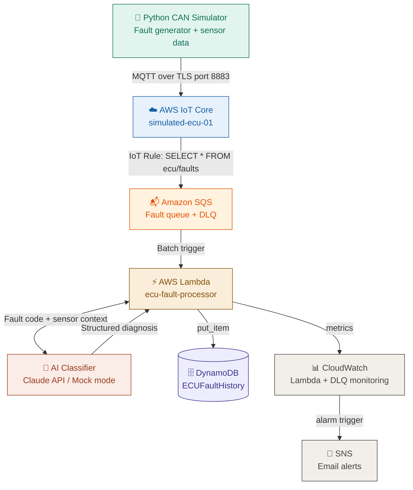

# ECU Fault Diagnostics — AI-Assisted Fleet Telemetry Pipeline

> Simulates connected vehicle ECU fault data, streams it to AWS IoT Core in real time, buffers through SQS for fleet-scale resilience, and uses AI to automatically classify and explain fault codes — mimicking the diagnostic automation used by automotive OEMs and fleet telematics platforms.

---

## Problem It Solves

Modern connected vehicle fleets generate millions of fault events daily. Manual diagnosis by technicians cannot scale — a single fault takes 15–45 minutes to diagnose manually. At fleet scale, simultaneous vehicle messages can overwhelm a direct Lambda invocation model, causing message loss under burst traffic.

This pipeline automates fault classification and root cause analysis using AI, with an SQS buffer ensuring no message is lost regardless of traffic volume — reducing diagnostic time to under 3 seconds per fault, at any scale.

**Relevant to:** JLR connected vehicle platform, Caterpillar industrial IoT, Microlise/Trakm8 fleet telematics, Bosch automotive diagnostics.

---

## Architecture



**Data flow:**
1. Python simulator generates realistic CAN bus fault codes and sensor readings (RPM, coolant temp, battery voltage)
2. Messages published to AWS IoT Core via MQTT over mutual TLS authentication on port 8883
3. IoT Rule routes every message to SQS using SQL: `SELECT * FROM 'ecu/faults'`
4. SQS buffers messages durably — handles fleet-scale bursts without Lambda throttling, retries failed messages up to 3 times before routing to Dead Letter Queue
5. Lambda reads from SQS in batches, calls AI classifier, stores structured diagnosis in DynamoDB
6. CloudWatch monitors Lambda errors AND DLQ message count — SNS email alert if either threshold breached

---

## Tech Stack

| Component | Technology |
|---|---|
| CAN Simulator | Python + cantools + paho-mqtt |
| Cloud Messaging | AWS IoT Core + MQTT (port 8883) |
| Device Security | Mutual TLS — X.509 certificates |
| Message Buffer | Amazon SQS + Dead Letter Queue |
| Network Security | AWS VPC — private subnets, NAT Gateway, VPC Endpoints |
| Serverless Processing | AWS Lambda (Python 3.11) |
| AI Fault Classification | Claude API / Mock mode |
| Fault History Storage | AWS DynamoDB (on-demand) |
| Infrastructure as Code | Terraform |
| CI/CD Pipeline | GitHub Actions |
| Monitoring | AWS CloudWatch + SNS email alerts |

---

## Pipeline Status

✅ Phase 1 — CAN simulator generating realistic fault data  
✅ Phase 2 — AWS IoT Core receiving messages via MQTT/TLS  
✅ Phase 3 — SQS buffer with DLQ — fleet-scale resilience  
✅ Phase 4 — Lambda processing batches from SQS  
✅ Phase 5 — DynamoDB storing 365+ fault records with AI diagnosis  
✅ Phase 6 — CloudWatch monitoring Lambda errors + DLQ depth  
✅ Phase 7 — AI classification layer (structured diagnosis active)  
✅ Phase 8 — Terraform IaC — 15 resources managed as code  
✅ Phase 9 — Lambda in private VPC subnet (eu-west-2a + eu-west-2b)  
✅ Phase 10 — VPC Endpoints — DynamoDB + SQS traffic stays off NAT Gateway  
✅ Phase 11 — GitHub Actions CI/CD — auto-deploy on push (43s)

---

## Why SQS Between IoT Core and Lambda?

Without SQS, IoT Core invokes Lambda directly per message. In a fleet of 5,000 vehicles reporting faults simultaneously, Lambda faces a concurrency spike — and if it hits its limit, messages are silently dropped.

SQS solves this at three levels:

**Durability** — messages queue reliably regardless of Lambda's processing speed. Nothing is lost during bursts.

**Resilience** — if Lambda fails processing a message, SQS retries automatically up to 3 times. On the 4th failure, the message routes to the Dead Letter Queue for investigation rather than disappearing.

**Observability** — a dedicated CloudWatch alarm on DLQ depth alerts immediately if messages are failing repeatedly — a distinctly fleet-aware signal beyond basic Lambda error monitoring.

---

## Why VPC Endpoints Instead of NAT Gateway for AWS Services

Lambda runs inside a private VPC subnet with no direct internet access.
Without VPC Endpoints, all traffic — including calls to DynamoDB and SQS —
would route through the NAT Gateway to the public internet and back into AWS.

Two VPC Endpoints solve this:

**DynamoDB Gateway Endpoint (free)** — routes DynamoDB traffic directly
through AWS's private network. No NAT Gateway charges, lower latency,
traffic never touches the public internet.

**SQS Interface Endpoint (~$7/month)** — creates a private IP inside the
VPC for SQS. Queue traffic stays entirely within AWS's network.

NAT Gateway now handles only what genuinely needs internet access —
the Claude API calls. This is the production-correct architecture:
pay for internet access only when you actually need it.

---

## Sample Fault Record

```json
{
  "fault_id": "FAULT-20260527005751-124",
  "timestamp": "2026-05-27T00:57:51.550109+00:00",
  "vehicle_id": "VH-SIM-001",
  "dtc_code": "P0115",
  "description": "Engine Coolant Temp Sensor Fault",
  "severity": "Medium",
  "sensor_data": {
    "RPM": 892,
    "coolant_temp_c": 78.6,
    "battery_voltage": 11.74
  },
  "processed_at": "2026-05-27T00:57:51.891519+00:00",
  "pipeline_latency_ms": 341,
  "ai_diagnosis": {
    "root_cause": "Engine coolant temperature sensor circuit fault. Sensor reading outside expected range — either sensor has failed or wiring harness has a fault.",
    "immediate_action": "Monitor engine temperature via dashboard gauge. If gauge shows overheating, stop vehicle immediately.",
    "long_term_fix": "Replace coolant temperature sensor. Inspect wiring harness for chafing or corrosion at connector.",
    "safety_risk": "Medium",
    "confidence": "High"
  }
}
```

---

## Key Engineering Decisions

**Why SQS between IoT Core and Lambda?**
Direct IoT→Lambda invocation cannot handle fleet-scale burst traffic without message loss. SQS decouples ingestion from processing — messages queue durably, Lambda drains at a sustainable rate, and the DLQ catches anything that fails after 3 retries. This is the production pattern used by Microlise, Samsara, and Trakm8 for fleet telemetry ingestion.

**Why MQTT over HTTP?**
MQTT is the industry standard protocol for IoT device messaging — designed for low-bandwidth, unreliable networks exactly like vehicle telematics. 2-byte fixed header vs kilobytes of HTTP overhead. Persistent connection vs request-response. QoS delivery guarantees.

**Why Lambda over an always-on server?**
ECU fault events are bursty — high volume during vehicle operation, zero during parking. Lambda scales to zero and costs nothing when idle. With SQS as the buffer, Lambda drains at a controlled rate regardless of upstream burst size.

**Why DynamoDB over SQL?**
Fault records have variable fields — different DTCs carry different metadata. DynamoDB's schemaless design accommodates this naturally without nullable columns or schema migrations.

**Why Terraform?**
13 AWS resources reproducible from a single `terraform apply`. Proves infrastructure is code — not dependent on manual console clicks. Demonstrated by destroying and rebuilding entire stack from scratch.

---

## Fault Codes Simulated

| DTC Code | Description | Severity |
|---|---|---|
| P0300 | Random Cylinder Misfire | High |
| P0115 | Engine Coolant Temp Sensor Fault | Medium |
| P0562 | System Voltage Low | High |
| U0100 | Lost Communication With ECM | Critical |
| P0171 | System Too Lean Bank 1 | Medium |
| P0420 | Catalyst Efficiency Below Threshold | Low |
| P0700 | Transmission Control System Fault | High |
| B0001 | Airbag Deployment Loop Fault | Critical |
| C0035 | Wheel Speed Sensor Fault | High |
| U0155 | Lost Communication With Instrument Panel | Medium |

---

## Prerequisites

- Python 3.10+
- AWS account (free tier sufficient)
- AWS CLI configured (`aws configure`)
- AWS IoT Core device certificates (see `simulator/certs/`)
- Terraform 1.11+ (for infrastructure provisioning)

---

## How to Run

```bash
# Clone the repo
git clone https://github.com/Ishcloud09/ecu-fault-diagnostics.git
cd ecu-fault-diagnostics

# Install dependencies
pip install -r requirements.txt

# Configure AWS credentials
aws configure

# Run the simulator
python simulator/mqtt_publisher.py
```

Watch fault messages publish every 5 seconds. Messages flow through IoT Core → SQS → Lambda → DynamoDB automatically. Check DynamoDB → ECUFaultHistory for records with AI diagnosis.

---

## Infrastructure as Code

Provision entire AWS infrastructure from scratch (13 resources):

```bash
cd terraform
terraform init
terraform plan
terraform apply
```

Destroys and rebuilds cleanly:

```bash
terraform destroy
terraform apply
```

---

## CI/CD Pipeline

Every push to `main` automatically:
1. Packages Lambda function into deployment zip
2. Deploys to AWS Lambda in eu-west-2
3. Runs `terraform validate` and `terraform plan`
4. Completes in under 34 seconds

See `.github/workflows/deploy.yml` for full pipeline definition.

---

## Portfolio Context

Built to demonstrate the embedded + cloud + AI intersection relevant to connected vehicle and fleet telematics roles. Simulates the exact pipeline architecture used in production fleet management platforms — from CAN bus fault generation through cloud streaming, SQS-buffered ingestion, to AI-assisted diagnosis at scale.

All infrastructure on AWS free tier. No physical hardware required — everything simulated in Python.

**Skills demonstrated:** AWS IoT Core, SQS, Lambda, DynamoDB, CloudWatch, SNS, Terraform, GitHub Actions, MQTT, mutual TLS, X.509, Python, automotive fault codes (OBD-II), AI API integration, infrastructure as code, CI/CD, fleet-scale architecture patterns.

---

## Author

Iswarya Thiagarajan  
[LinkedIn](https://www.linkedin.com/in/iswaryathiagarajan091096)  
[GitHub](https://github.com/Ishcloud09)